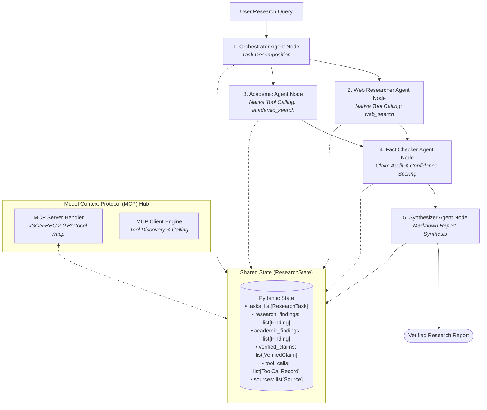

# Multi-Agent Research System


An enterprise-grade, recruiter-friendly **Multi-Agent Research System** built with **FastAPI**, **LangGraph**, **LangChain Native Tool Calling**, and **Model Context Protocol (MCP)**, coupled with a minimalist **React + Vite** frontend.

---

## 🎯 Problem Statement & Solution

Manual research across web data and academic literature is slow and prone to hallucinated citations. Single-prompt LLM queries lack structured verification, tool auditability, and standardized protocol access.

This system solves these challenges by:
- **Orchestrating 5 Specialized Agent Nodes** via LangGraph (`Orchestrator` → `Web Researcher` → `Academic Researcher` → `Fact Checker` → `Synthesizer`).
- **Standardizing Tool Calling** using Pydantic input schemas (`args_schema`) and execution audit trails (`ToolCallRecord`).
- **Exposing Model Context Protocol (MCP)** via JSON-RPC 2.0 protocol (`/mcp`) for universal tool discovery and execution.
- **Guaranteeing Zero-Hallucination Citations** by strictly attributing findings to verified retrieved sources.

---

## 🏛️ System Architecture



---

## 📂 Simplified Module Architecture

The backend is organized into **6 clean, top-level Python modules** inside `app/`:

| Module | Purpose |
| :--- | :--- |
| **[`app/models.py`](file:///c:/Projects/Multi%20Agent%20Research%20System/app/models.py)** | Pydantic data schemas for `ResearchState`, `ResearchTask`, `Finding`, `Source`, `VerifiedClaim`, `ToolCallRecord`, and FastAPI payloads. |
| **[`app/tools.py`](file:///c:/Projects/Multi%20Agent%20Research%20System/app/tools.py)** | Search implementations (`search_web`, `search_academic`), LangChain `@tool` wrappers with Pydantic `args_schema`, and `ToolRegistry`. |
| **[`app/agents.py`](file:///c:/Projects/Multi%20Agent%20Research%20System/app/agents.py)** | 5 agent node functions (`run_orchestrator`, `run_researcher`, `run_academic`, `run_fact_checker`, `run_synthesizer`). |
| **[`app/workflow.py`](file:///c:/Projects/Multi%20Agent%20Research%20System/app/workflow.py)** | LangGraph `StateGraph` compilation and execution pipeline (`run_research_workflow`). |
| **[`app/mcp.py`](file:///c:/Projects/Multi%20Agent%20Research%20System/app/mcp.py)** | Model Context Protocol (MCP) server & client handlers implementing JSON-RPC 2.0 standard. |
| **[`app/main.py`](file:///c:/Projects/Multi%20Agent%20Research%20System/app/main.py)** | FastAPI web application exposing REST endpoints (`/health`, `/api/research`, `/api/mcp/tools`, `/api/mcp/call`, `/mcp`). |

---

## ⚡ Core Technical Features

### 1. Model Context Protocol (MCP) Integration
- **Standard Protocol Endpoint**: Handles JSON-RPC 2.0 payload requests at `/mcp` (`initialize`, `tools/list`, `tools/call`).
- **MCP Client Engine**: In-memory client for discovering tool schemas and executing tools programmatically.
- **MCP Playground UI**: Dedicated tab in the frontend for testing MCP tool invocations and inspecting raw JSON-RPC responses.

### 2. Native Tool Calling & Execution Auditing
- **Pydantic Validation**: Input validation with `WebSearchInput` (`query`, `max_results`) and `AcademicSearchInput` (`query`, `max_results`).
- **LangChain `@tool` Wrappers**: Registered `@tool("web_search")` and `@tool("academic_search")` bound to agent execution nodes.
- **Audit Records**: `ToolCallRecord` logs `tool_name`, `args`, `result_summary`, `agent`, and `timestamp` for every execution.

### 3. Minimalist White UI Design
- **Clean Aesthetic**: Crisp white theme (`bg-white` / `bg-slate-50`), border lines (`border-slate-200`), and dark text (`text-slate-900`).
- **No Clutter**: Free of unnecessary emojis, stickers, or pill badges.
- **Tabbed Dashboard**:
  - **Research Report**: Synthesized markdown report, verified claims table, and reference links.
  - **Tool Calling Trace**: Real-time audit trail of tool invocations during execution.
  - **MCP Protocol Hub**: Interactive MCP tool tester.

---

## 🚀 Getting Started

### 1. Backend Setup

```bash
# Clone repository
git clone https://github.com/soumyadip-das-dev/Multi-Agent-Research-System.git
cd Multi-Agent-Research-System

# Create virtual environment
python -m venv .venv
# On Windows:
.\.venv\Scripts\activate
# On macOS/Linux:
source .venv/bin/activate

# Install dependencies
pip install -r requirements.txt

# Configure environment variables (.env)
cp .env.example .env
```

### 2. Configure Environment Variables (`.env`)

```env
LLM_PROVIDER=gemini  # Supported: gemini, openai
GEMINI_API_KEY=your_gemini_api_key_here
TAVILY_API_KEY=your_tavily_api_key_here
SEMANTIC_SCHOLAR_API_KEY=  # Optional
HOST=0.0.0.0
PORT=8000
```

> 💡 **Fallback Mode**: If no API keys are configured, the system seamlessly operates in **Simulated Fallback Mode**, generating realistic research data for immediate testing.

### 3. Run Backend Server

```bash
uvicorn app.main:app --reload --port 8000
```

### 4. Run Frontend App

```bash
cd frontend
npm install
npm run dev
```

Access the frontend dashboard at `http://localhost:3000`.

---

## 📡 API Endpoints

### Health Diagnostics
```http
GET /health
```

### Execute Research Workflow
```http
POST /api/research
Content-Type: application/json

{
  "query": "What is the impact of generative AI on software engineering jobs?"
}
```

### Discover MCP Tools
```http
GET /api/mcp/tools
```

### Execute MCP Tool via REST
```http
POST /api/mcp/call
Content-Type: application/json

{
  "tool_name": "web_search",
  "arguments": {
    "query": "Generative AI coding productivity metrics",
    "max_results": 3
  }
}
```

### Model Context Protocol (MCP) JSON-RPC Endpoint
```http
POST /mcp
Content-Type: application/json

{
  "jsonrpc": "2.0",
  "id": 1,
  "method": "tools/call",
  "params": {
    "name": "web_search",
    "arguments": { "query": "AI software engineering", "max_results": 3 }
  }
}
```

---

## 🧪 Automated Testing

Run the full Pytest suite:

```bash
python -m pytest -v
```

**Test Coverage (26 / 26 passed)**:
- `test_health.py`: System health and MCP tool count check.
- `test_models.py`: Pydantic models & state default values.
- `test_tools.py`: Search tool fallback and query validation.
- `test_agents.py`: Node execution logic for all 5 agents.
- `test_workflow.py`: LangGraph StateGraph integration test.
- `test_mcp.py`: MCP Server JSON-RPC & Client discovery suite.
- `test_tool_calling.py`: ToolRegistry execution & ToolCallRecord logging.
- `test_api.py`: FastAPI endpoints integration test.

---

## 📄 License

Distributed under the MIT License.
