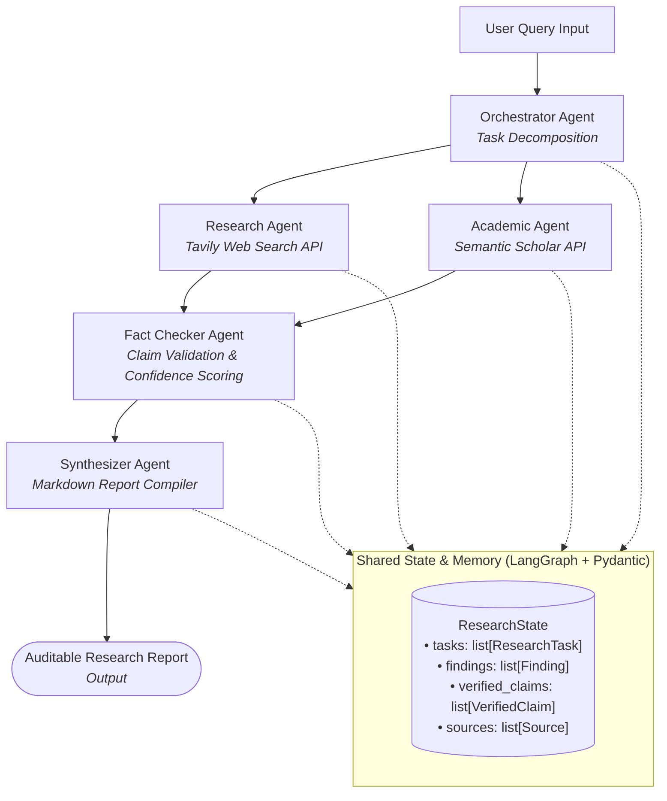

# 🚀 Multi-Agent Research System


> 🔗 **Live Demo / API Endpoint:** [`http://localhost:8000/docs`](http://localhost:8000/docs)  
> **Try the live system with sample research questions and see automated multi-agent synthesis & fact-checking in action.**

---

## 🎯 Problem Statement

Manual web and literature research is **slow, tedious, and prone to error**. Single prompt-based LLM queries frequently suffer from:
- **Hallucinated URLs** and fake academic citations.
- **Lack of peer-reviewed rigor** and source verification.
- **Monolithic context overload** without modular task delegation or auditability.

This system uses a **team of specialized AI agents** to decompose research questions into subtasks, execute concurrent web and academic search, fact-check claims against raw evidence, and synthesize verified reports with authentic citations.

---

## 🏛️ Architecture Overview



---

<table>
<tr>
<td width="50%" valign="top">

### ✨ Key Features

- ✅ **Multi-Agent Orchestration**: StateGraph control flow powered by **LangGraph**.
- ✅ **Dual-Source Retrieval**: Web search via **Tavily API** + Academic paper search via **Semantic Scholar**.
- ✅ **Automated Fact-Checking**: Validates claims against raw evidence with confidence levels (`HIGH`, `MEDIUM`, `LOW`).
- ✅ **Strict Citation Integrity**: Only real, retrieved sources are permitted in the final report.
- ✅ **Interactive Dashboard**: Modern dark-themed UI built with **React 19** & **Tailwind CSS v4**.

</td>
<td width="50%" valign="top">

### 🔗 Tech Stack


</td>
</tr>
</table>

---

## 📋 How to Run Locally

```bash
git clone https://github.com/username/multi-agent-research-system.git && cd multi-agent-research-system
python -m venv .venv && source .venv/bin/activate # (or .\.venv\Scripts\activate on Windows)
pip install -r requirements.txt && cd frontend && npm install && cd ..
uvicorn app.main:app --reload & cd frontend && npm run dev
```

---

<div align="center">

⭐ **Star the repo if you find it useful!** &nbsp;&nbsp;•&nbsp;&nbsp; 💬 **Issues & PRs are welcome!** 🚀

</div>

---

## 🤖 Agents Breakdown

| Agent Node | Responsibility | Primary Tool / Output |
| :--- | :--- | :--- |
| **Orchestrator Agent** | Analyzes research queries and decomposes them into focused subtasks. | List of `ResearchTask` (`type: "web"` or `"academic"`) |
| **Research Agent** | Executes web searches to retrieve current news, web pages, and articles. | **Tavily API** → List of web `Finding` objects |
| **Academic Agent** | Searches peer-reviewed literature for journal papers and studies. | **Semantic Scholar API** → List of academic `Finding` objects |
| **Fact Checker Agent** | Cross-references extracted claims against evidence & identifies contradictions. | List of `VerifiedClaim` objects with `HIGH` / `MED` / `LOW` confidence |
| **Synthesizer Agent** | Compiles verified findings into a structured, citation-backed report. | Final Markdown Report adhering strictly to supplied sources |

---

## 📦 Shared Research State (`ResearchState`)

State is strictly validated across agent nodes using Pydantic:

```python
class ResearchState(BaseModel):
    query: str
    tasks: list[ResearchTask] = []
    research_findings: list[Finding] = []
    academic_findings: list[Finding] = []
    claims: list[str] = []
    verified_claims: list[VerifiedClaim] = []
    final_report: str = ""
    sources: list[Source] = []
    status: str = "pending"
    error: Optional[str] = None
```

---

## 🛠️ Step-by-Step Setup Guide

### 1. Backend Environment Setup

```bash
# Navigate to repository root
cd multi-agent-research-system

# Create & activate virtual environment
python -m venv .venv
# On Windows:
.\.venv\Scripts\activate
# On macOS/Linux:
source .venv/bin/activate

# Install dependencies
pip install -r requirements.txt

# Create .env file from template
cp .env.example .env
```

### 2. Configure Environment Variables (`.env`)

```env
LLM_PROVIDER=gemini  # Supported: gemini, openai
GEMINI_API_KEY=your_gemini_api_key_here
TAVILY_API_KEY=your_tavily_api_key_here
SEMANTIC_SCHOLAR_API_KEY=  # Optional
HOST=0.0.0.0
PORT=8000
```

> 💡 **Note on Demo/Fallback Mode**: If no LLM or Tavily API key is provided, the system operates in **Simulated Fallback Mode**, generating realistic research data for immediate frontend and workflow testing.

### 3. Frontend Setup

```bash
cd frontend
npm install
npm run dev
```

The frontend dashboard runs at `http://localhost:3000`.

---

## 📡 API Reference

### Health Check

```http
GET /health
```

**Response**:
```json
{
  "status": "ok",
  "service": "Multi-Agent Research System API",
  "llm_provider": "gemini",
  "has_tavily_key": true
}
```

### Execute Research Pipeline

```http
POST /api/research
Content-Type: application/json

{
  "query": "What is the impact of generative AI on software engineering jobs?"
}
```

**Response**:
```json
{
  "query": "What is the impact of generative AI on software engineering jobs?",
  "status": "completed",
  "report": "# Research Report\n\n## Executive Summary\n...",
  "sources": [
    {
      "title": "GitHub Copilot Impact Study",
      "url": "https://github.blog/2024-research-copilot-impact",
      "source_type": "web"
    }
  ],
  "tasks": [...],
  "verified_claims": [...]
}
```

---

## 🧪 Running Automated Tests

Run the full pytest suite:

```bash
pytest -v
```

**Coverage Includes**:
- `test_health.py`: Endpoint availability and health status.
- `test_models.py`: Pydantic schema validation and state transitions.
- `test_tools.py`: Web and academic search tool integrations.
- `test_agents.py`: Individual node execution logic.
- `test_workflow.py`: End-to-end LangGraph StateGraph execution.
- `test_api.py`: FastAPI route integration.

---

## 💡 Key Design Decisions & Interview Talking Points

1. **Why LangGraph over standard chains?**  
   LangGraph provides cyclic state graph capabilities, explicit state transitions, and easy inspection of intermediate node states (tasks, findings, verified claims) compared to linear chains.
2. **Auditability & Fact Checking**:  
   The `Fact Checker Agent` introduces explicit guardrails, tagging each claim with a confidence level before the synthesizer generates the final report.
3. **Zero-Hallucination Citation Policy**:  
   The `Synthesizer Agent` is constrained by strict system prompts to only reference items present in `ResearchState.sources`.

---

## 🔮 Future Roadmap

- ⚡ **Real-Time Streaming**: Server-Sent Events (SSE) for streaming graph step updates to the UI.
- 📄 **Document RAG**: PDF/Document upload with FAISS vector search integration.
- 👤 **Human-in-the-Loop**: Interactive approval step for query subtasks before execution.
- 📥 **Export to PDF**: One-click PDF report generation and download.

